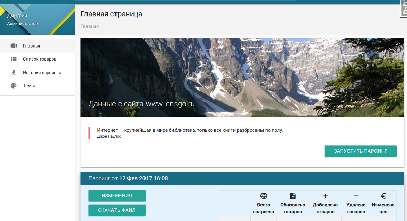
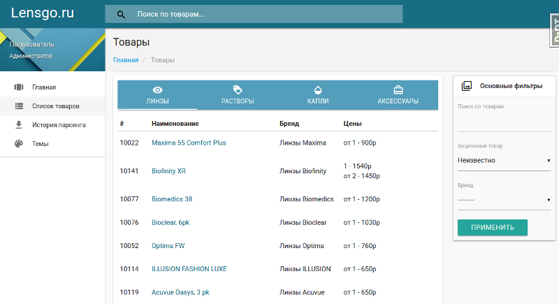

## README ##

It is a Django project for parsing and store information about products from web-store site. 
Main types of products are: lenses, drops, solutions and any accessories.

### Some info ###
 
For example, project works with site http://www.lensgo.ru/. 
"get_data" module contains logic of parsing. Change it for yourself if necessary.

### Main features ###
 
* Parsing info (for example - from site http://lensgo.ru/)
* Merge fetched info with stored data
* Email notification after each sync
* Periodic / manual running parse and sync tasks
* Search and filter products

### Interface example ###

start page (Material design theme)

products list (Material design theme)

